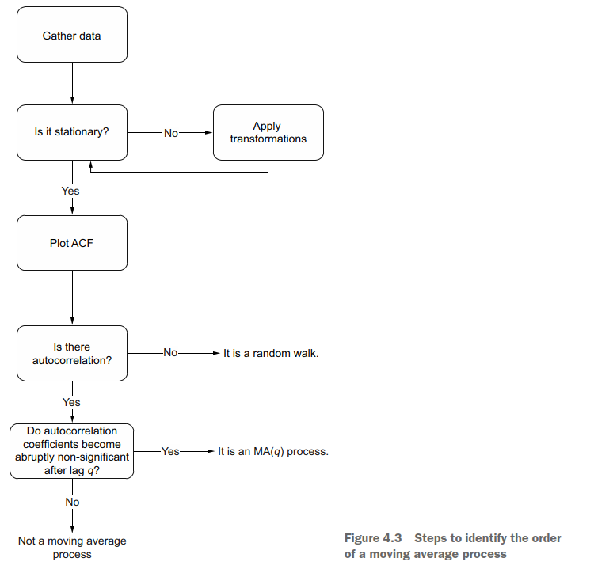

# Simulating a *Moving Average* process in time series
The purpose of this reppository is learning to identify a Moving Average process. In order to do that, the definition and the process to identify this sort of series is presented. The next diagram shows the general process:

An MA(2) process will be simulated using the equation:
$$y_t = 0.9 \theta_{t-1} + 0.3\theta_{t-2}$$
The actions to execute are:
1. Gather data: Simulate de MA(2) model with the above equation.
2. Test stationary.
    - Apply transformations until our series is stationary.
4. Plot ACF and get the order of our MA model: Get the acutocorrelation coefficients and the order of our MA model
5. Apply a method to forecast.

Bibliography:
- Peixeiro, M. (2022). Time Series Forecasting in Python (1st ed., Chapter 4, pp. 61-80). Manning Publications.
